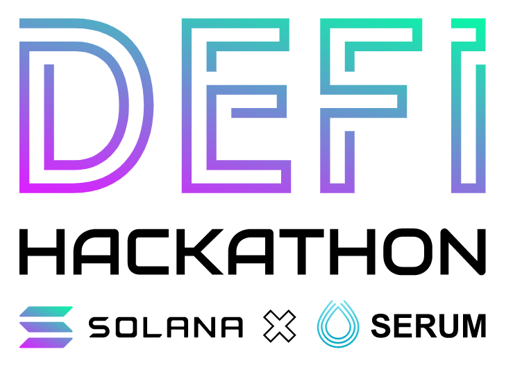
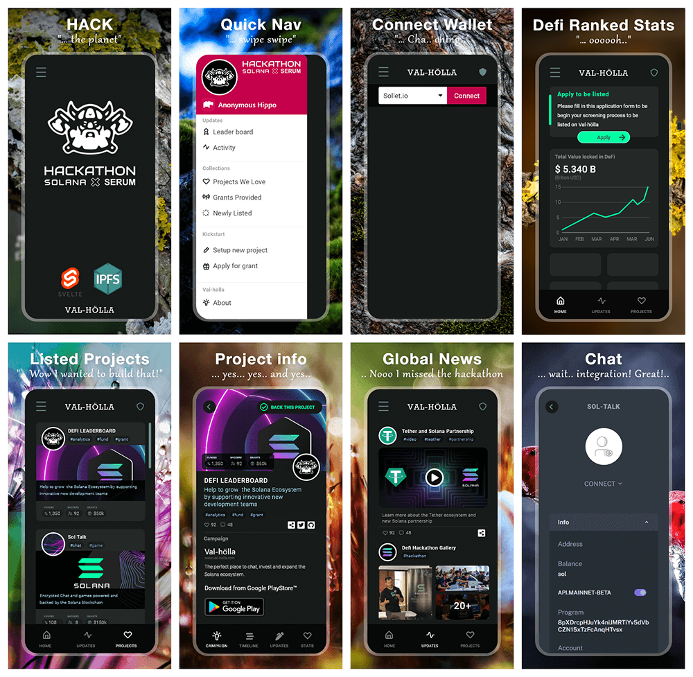

[](https://app.netlify.com/sites/valholla/deploys)

<p align="center">
  
  
  
  <br>
  <br>
</p>

# Val-hölla
The perfect place to chat, invest and expand the Solana ecosystem.<br />
www.val-holla.com

<p align="center">
  <a href="./static/hackThePlanet.png"></a>
  
  <br>
  <br>
</p>

# Install app

Val-hölla is a progressive Web APp, the next generation of mobile applications. Once installed you won't feel a difference to a native Android or iOS app, only that you never need to update it.

## Android

Download from Google PlayStore™


### or install as PWA:

Open www.val-holla.com in a PWA compatible browser.


## Chrome (recommended) / Brave

Once you open the page the browser will open a banner at the bottom of the page that says "Add Val-hölla to Home screen". Click on it and you're ready to go.

If the banner does not appear click on the menu icon and in the menu "Add to Home screen". That's it, open the app via the app icon.

## Firefox

In the address bar, to the right of the page URL you should see a little house icon with a plus symbol in the middle. Click on it and '+ Add to home screen'. That's it!

_NOTE: There might be some limitations when installing Val-hölla with Brave or Firefox due to limited PWA support, we strongly recommend to install the app with Chrome._

## iOS

Open this page with Safari, click on the share button (box with up arrow) and in the opening popup "Add to Home Screen". Ready!

## Desktop (Chrome/Edge)

To install Val-hölla on your desktop open this page with Chrome and click on the small plus icon  on the right side of the address bar. If you do not see the icon, click on the menu icon and "Add to Home screen". 


_NOTE: The app also works perfectly fine in the browser and you do not need to install it on your device. However, we recommend to install it for a better user experience._

# Developer Setup

## Install
```
git clone https://github.com/JohnRSim/valholla
cd valholla
npm install
```

## Running
```
npm run dev
```

## Usage
1. Navigate to http://localhost:3000
